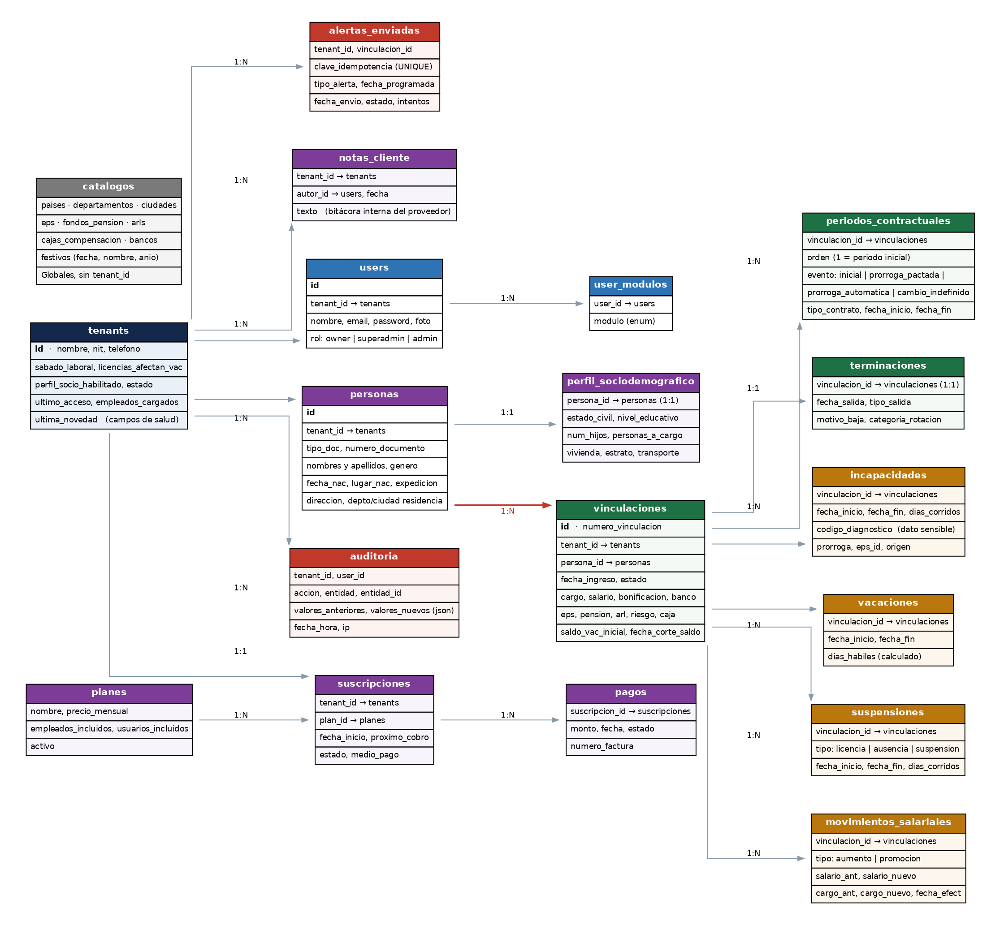

# Arquitectura y Modelo de Datos — Sistema de Gestión de Talento Humano

> Documento técnico
> Documento de referencia del proyecto. Generado desde la fuente original; no editar a mano.

**DOCUMENTO TÉCNICO**
**Arquitectura y Modelo de Datos**
**Sistema de Gestión de Talento Humano**
*Stack, base de datos, procesos y seguridad*
*Complementa la Especificación Funcional. Dirigido a quien escribe el código.*
Documento 3 · Versión 1.0

## Para qué sirve este documento

La Especificación Funcional dice qué hace el sistema. Este documento dice cómo se construye: con qué herramientas, cómo se guardan los datos, cómo corren los procesos automáticos y cómo se protege la información de cada empresa.
Contiene tres cosas que no se pueden improvisar sobre la marcha: la elección del stack, el modelo de datos y la estrategia de aislamiento entre empresas. Las tres son caras de cambiar una vez que hay código escrito.

> **Resumen de las decisiones**
>
> · Stack: Laravel 12 con Inertia y Vue 3, sobre PostgreSQL.
>
> · Multiempresa: una sola base de datos, columna tenant_id en cada tabla, con dos capas de protección: global scope en el ORM y Row Level Security en PostgreSQL.
>
> · Modelo de datos: Persona y Vinculación son entidades separadas. Es la decisión estructural más importante del proyecto.
>
> · El saldo de vacaciones no es una columna: es un cálculo. Se deriva del saldo inicial más los eventos registrados.
>
> · Alertas: un solo proceso diario, idempotente, con registro de envíos.
>
> · Infraestructura inicial: plataforma administrada, no servidor propio.

## Contenido

<!-- tabla de contenido generada por el editor -->

## 1. Stack tecnológico

### 1.1 Qué necesita este sistema en particular

Antes de elegir herramientas conviene mirar qué es realmente este producto. No es una aplicación con gráficos complejos ni tiempo real ni volúmenes masivos. Es:
- Seis pantallas de tabla con filtros, creación, edición y eliminación.
- Un motor de reglas de negocio con bastante lógica legal.
- Un proceso automático diario que calcula y envía correos.
- Exportaciones a Excel y una importación masiva.
- Un dashboard con cifras agregadas.
- Autenticación con permisos por módulo y aislamiento entre empresas.

Dicho de otro modo: el 70% del trabajo son tablas y formularios que se repiten, y el 30% es lógica de negocio. La herramienta correcta es la que permita construir esos patrones una sola vez y reutilizarlos en las siete pantallas.

### 1.2 Recomendación

| Capa | Elección | Por qué |
|---|---|---|
| Framework | Laravel 12 (PHP 8.3+) | Trae de fábrica exactamente las cuatro cosas que este sistema más necesita: autenticación, colas, tareas programadas y envío de correo. No hay que armar ninguna de ellas. |
| Interfaz | Inertia 2 + Vue 3 + Tailwind | Vue con Inertia sobre Laravel: se escriben componentes Vue y el enrutamiento y los datos los sigue manejando Laravel, sin construir una API aparte. Es el camino oficial del ecosistema (Laravel Starter Kit) y evita la separación entre backend y frontend, que con una sola persona es puro trabajo doble. |
| Componentes de interfaz | shadcn-vue sobre Tailwind | Componentes accesibles que se copian al proyecto en lugar de instalarse como dependencia, así que se pueden ajustar al sistema de diseño del Documento 4. Cubren tabla, modal, formulario, selector de fecha y notificación, que son el 90% de lo que este sistema necesita. |
| Tabla de datos | TanStack Table para Vue | Ordenamiento, filtros, paginación y encabezado fijo. Es la pieza que más se repite: siete pantallas de listado con el mismo comportamiento. |
| Base de datos | PostgreSQL 16+ | Por Row Level Security, que es la red de seguridad del aislamiento entre empresas. MySQL no la tiene y obligaría a confiar únicamente en el código de la aplicación. |
| Cola de trabajos | Laravel Queue sobre Redis o sobre la misma base de datos | Para no enviar correos dentro de la petición del usuario. Con el volumen inicial, la cola sobre base de datos es suficiente y evita un servicio más. |
| Correo transaccional | Un proveedor especializado (Postmark, Resend o Amazon SES) | La entregabilidad es parte del producto. Enviar desde el servidor propio garantiza que las alertas terminen en spam. |
| Exportación a Excel | Laravel Excel | Estándar en el ecosistema, maneja tanto la exportación como la importación con validación por fila. |
| Pruebas | Pest para el servidor, Vitest para los componentes | La batería del motor de cálculo es obligatoria. Vitest cubre los componentes de Vue que tienen lógica propia, como el cálculo de días en pantalla. |

### 1.3 Por qué esta elección y no otra

Se evaluaron tres caminos razonables. Ninguno es una mala decisión; la diferencia está en cuánto tiempo de una sola persona consume cada uno y en cuánto control deja sobre la interfaz.

| Opción | A favor | En contra para este caso |
|---|---|---|
| Laravel + Inertia + Vue | Un solo proyecto, un solo despliegue, sin API intermedia. Tareas programadas, colas, autenticación y correo integrados. Control total sobre la interfaz, que es lo que exige el objetivo de que el producto no parezca improvisado. El ecosistema de despliegue (Forge, Vapor) ya lo conoce David. | Las tablas con filtros y las exportaciones hay que construirlas, a diferencia de un panel generado. Se compensa construyendo una sola vez los componentes que las siete pantallas comparten. |
| Laravel + Filament | El CRUD, los filtros y las exportaciones vienen casi gratis a partir de la definición del modelo. | La interfaz queda atada a la estética y a los patrones de Filament. Los flujos propios de este sistema —el asistente de cuatro pasos, el modal de documento con ficha del empleado, el panel de inicio orientado a la acción— se salen de ese molde y habría que pelear con la herramienta. |
| Next.js + Supabase | El camino más popular para SaaS nuevos, TypeScript de punta a punta. | Las tareas programadas exigen un servicio aparte y hay que armar la autenticación por módulos. Para un sistema fundamentalmente administrativo se paga trabajo que Laravel ya trae hecho. |

> **La advertencia que vale más que la elección**
>
> La forma más rápida de retrasar un producto es dedicar tres semanas a elegir el stack perfecto en lugar de empezar a construir. Cualquiera de las tres opciones llega al MVP.
>
> Si David domina otro stack, ese es el correcto. El framework que el desarrollador conoce a fondo le gana a cualquier recomendación de un documento.

## 2. Arquitectura multiempresa

El sistema atenderá a muchas empresas sobre la misma instalación. La forma de separarlas es la decisión de arquitectura con mayor consecuencia: un error aquí hace que una empresa vea la nómina de otra.

### 2.1 Las tres estrategias posibles

| Estrategia | Cómo funciona | Valoración |
|---|---|---|
| Base de datos por empresa | Cada cliente tiene su propia base de datos. | Máximo aislamiento, pero cada cambio de estructura hay que aplicarlo a decenas de bases. Inviable de mantener con una sola persona. |
| Esquema por empresa | Una base, un esquema por cliente. | Punto medio. Más simple que lo anterior pero aún exige migrar esquema por esquema. |
| Compartida con tenant_id | Una base, unas tablas, una columna que identifica a qué empresa pertenece cada fila. | Lo más barato de operar, lo más simple de migrar y lo más rápido de dar de alta un cliente. Es el patrón dominante en SaaS B2B. Su único riesgo es olvidar el filtro en alguna consulta. |

### 2.2 Decisión

**DECISIÓN.** Base de datos compartida con columna **tenant_id** en toda tabla que contenga información de clientes, y **dos capas de protección independientes** contra el riesgo de olvidar el filtro.

#### Capa 1 — Global scope en el ORM

Un trait aplicado a todos los modelos que pertenecen a una empresa. Añade automáticamente la condición de tenant a cada consulta y rellena el tenant_id al crear registros. El código de la aplicación nunca escribe el filtro a mano.
*Consecuencia práctica: si un desarrollador olvida el filtro, no pasa nada, porque el filtro no lo pone el desarrollador.*

#### Capa 2 — Row Level Security en PostgreSQL

Políticas a nivel de base de datos que impiden devolver filas de otra empresa aunque la consulta llegue sin filtro. Se activa fijando el identificador de empresa en una variable de sesión al inicio de cada petición.

> **Por qué dos capas y no una**
>
> El global scope se puede desactivar sin querer: una consulta escrita en SQL directo, un reporte hecho con el query builder, un comando de consola. En todos esos casos el filtro del ORM no aplica.
>
> Row Level Security es la última línea de defensa y actúa incluso si el código está mal escrito. Es barata de implementar al principio y prácticamente imposible de agregar después sin auditar todo el sistema.
>
> La regla del proyecto: RLS se activa desde la primera migración, no cuando haya clientes.

### 2.3 Reglas de implementación

- Toda tabla con datos de clientes lleva tenant_id, indexado, y forma parte de los índices compuestos de las consultas frecuentes.
- Los catálogos globales —países, ciudades, EPS, festivos— no llevan tenant_id y quedan fuera de las políticas.
- El identificador de empresa se resuelve una sola vez por petición, a partir del usuario autenticado, en un middleware. Nunca se toma de un parámetro de la URL ni del formulario.
- **Los trabajos en cola deben restaurar el contexto de empresa antes de ejecutarse.** Es el error clásico: un proceso en segundo plano corre sin contexto y consulta sin filtro. El identificador viaja serializado con el trabajo y se restablece al inicio, con limpieza garantizada al final aunque el trabajo falle.
- Los procesos programados que recorren todas las empresas lo hacen empresa por empresa, estableciendo el contexto en cada iteración, no con una consulta global.
- Existe una batería de pruebas cuyo único propósito es intentar leer datos de otra empresa por todos los caminos posibles y fallar si alguno lo consigue.

## 3. Modelo de datos

### 3.1 Diagrama

*Modelo entidad-relación. En rojo, la relación que sostiene toda la arquitectura: una persona puede tener varias vinculaciones.*

### 3.2 La decisión estructural: Persona y Vinculación son cosas distintas

**CRÍTICO.** Es el punto donde este proyecto se puede arruinar en silencio. La Especificación Funcional dice que "cada vinculación laboral es un registro independiente" y que "si una persona vuelve a ser contratada se crea un registro nuevo". Eso significa que **empleado no es una entidad** : son dos.

| Entidad | Qué guarda | Cuándo cambia |
|---|---|---|
| Persona | Lo que pertenece al ser humano: documento, nombres, fecha y lugar de nacimiento, género, dirección, perfil sociodemográfico. | Rara vez. No depende de estar contratado o no. |
| Vinculación | Lo que pertenece a la relación laboral: fecha de ingreso, cargo, salario, tipo de contrato, EPS, ARL, estado, saldo de vacaciones. | Nace y muere con cada contratación. Una persona puede tener varias a lo largo del tiempo. |

##### Qué pasa si se modela como una sola tabla

- Al recontratar a alguien hay que duplicar sus datos personales, y entonces existen dos versiones de la misma persona que se desincronizan.
- La advertencia de reingreso —que exige detectar que ese documento ya tuvo una vinculación anterior— se vuelve una consulta frágil sobre datos duplicados.
- El indicador de rotación empieza a contar personas como si fueran distintas.
- Corregirlo después obliga a migrar datos de clientes en producción, que es la peor clase de trabajo que existe.

> **Regla derivada**
>
> El número de documento es único por empresa dentro de la tabla de personas, no dentro de la tabla de vinculaciones.
>
> Al registrar un empleado nuevo, el sistema primero busca si la persona ya existe con ese documento. Si existe, reutiliza la persona y crea una vinculación nueva; ahí es donde se dispara la advertencia de reingreso. Si no existe, crea ambas.

### 3.3 El historial de contrato

La tabla de periodos contractuales resuelve el submódulo de renovaciones. Cada fila es un tramo de la vida del contrato, y el primero es el contrato original.

| Campo | Contenido |
|---|---|
| orden | 1 para el periodo inicial, 2 en adelante para cada movimiento posterior. |
| evento | inicial · prorroga_pactada · prorroga_automatica · cambio_a_indefinido |
| tipo_contrato | La modalidad vigente en ese tramo. Permite ver el momento exacto en que un contrato pasó de fijo a indefinido. |
| fecha_inicio, fecha_fin | Las fechas del tramo. En indefinido y obra o labor, fecha_fin queda vacía. |

##### Lo que se calcula sobre esta tabla

- Número de prórrogas acumuladas: cuántas filas con evento de prórroga tiene la vinculación. Es el insumo de la regla de la prórroga corta.
- Duración total del vínculo a término fijo: desde la fecha de inicio del primer tramo, o desde el 25 de junio de 2025 si el contrato es anterior a esa fecha. Es el insumo del tope de cuatro años.
- Fecha de vencimiento vigente: la fecha_fin del último tramo.
- El historial que ve el usuario, incluido el periodo inicial, que era un requerimiento expreso.

**Nota:** el campo **evento** distingue prórroga pactada de automática, que es el punto pendiente número 9 del documento de Puntos Pendientes. El modelo ya lo contempla; si Angela decide no distinguirlas, el campo simplemente queda con un solo valor y no hay nada que rehacer.

### 3.4 El saldo de vacaciones no es una columna

**CRÍTICO.** El saldo se calcula, no se guarda. Guardar un número que se suma y se resta produce inconsistencias silenciosas que nadie sabe explicar meses después.

> **La fórmula**
>
> saldo(fecha) = saldo_inicial
>
>             + acumulación desde la fecha de corte del saldo inicial hasta la fecha consultada
>
>             − días de vacaciones disfrutados registrados
>
>             − reducción por suspensiones, si la empresa tiene ese parámetro activo
>
> La acumulación es de 1,25 días por mes completo trabajado, prorrateada para los meses parciales.

##### Por qué esto resuelve tres problemas de una vez

- Corregir la fecha de ingreso recalcula todo automáticamente, que es exactamente lo que pide la Especificación Funcional.
- Eliminar un registro de vacaciones restituye el saldo sin necesidad de ninguna operación inversa.
- La carga inicial funciona: el saldo inicial es el punto de partida y la acumulación corre desde la fecha de corte, sin inventar periodos de vacaciones falsos.

Para el dashboard, donde hay que sumar el saldo de toda la planta, conviene una tabla de caché refrescada cada noche por el mismo proceso que envía las alertas. La caché es una optimización de lectura, nunca la fuente de verdad.

### 3.5 Las tablas del lado del proveedor

Cuatro tablas no pertenecen a ninguna empresa cliente: son del negocio. Solo el rol owner las alcanza, y no forman parte de las políticas de aislamiento en el sentido habitual.

| Tabla | Contenido |
|---|---|
| planes | Nombre, precio mensual, empleados incluidos, usuarios incluidos, estado. |
| suscripciones | Empresa, plan, fecha de inicio, próximo cobro, estado y medio de pago. |
| pagos | Suscripción, monto, fecha, estado y número de factura. |
| notas_cliente | La bitácora interna: empresa, autor, fecha y texto. Es donde queda constancia de lo que se le prometió a quién. |

Además, la tabla de empresas lleva tres campos de salud: **último acceso de cualquiera de sus usuarios, número de empleados cargados y fecha de la última novedad registrada** . Se podrían calcular, pero conviene guardarlos porque se consultan en el listado de empresas y son la señal temprana de que un cliente se va a ir. Los actualiza el mismo proceso diario que envía las alertas.

> **El panel que las usa**
>
> Estas tablas existen para el panel del proveedor, que se especifica en el Documento 6. Ese panel es una aplicación aparte de la que ve el cliente: vive en otra dirección y ningún usuario de una empresa puede llegar a ella.
>
> Sin ese panel no hay forma de crear la primera empresa cliente salvo insertando filas a mano en la base de datos.

### 3.6 Convenciones

- Nombres de tablas y columnas en español, en minúscula y con guión bajo. El dominio es colombiano y el vocabulario laboral no tiene buena traducción; mezclar idiomas produce nombres como employee_incapacidad que no ayudan a nadie.
- Toda tabla lleva fecha de creación y de última modificación.
- **Nunca se borra físicamente.** Todas las tablas de negocio llevan borrado lógico. El registro desaparece de las vistas pero permanece, y queda constancia de quién lo eliminó.
- Los valores monetarios se guardan como enteros o como decimales con precisión fija. Nunca como número de coma flotante.
- Las fechas laborales se guardan como fecha sin hora. Es la fuente del error clásico de zona horaria en el que el 1 de agosto se interpreta como 31 de julio a las 19:00.
- Los enumerados se guardan como texto legible, no como números. Un reporte exportado debe poder leerse sin un diccionario.

## 4. Motor de cálculo

Un único componente, con métodos de nombre explícito, del que dependen todos los módulos. Es el corazón del producto y la parte que debe estar cubierta de pruebas.

### 4.1 Las tres reglas de conteo

**CRÍTICO.** Son tres reglas distintas y no deben poder confundirse. La forma de garantizarlo es que sean tres funciones con nombres distintos, no una función con un parámetro que se pueda pasar mal.

| Función | Regla | Se usa en |
|---|---|---|
| diasHabilesVacaciones(inicio, fin, empresa) | Excluye domingos y festivos. Excluye sábados solo si la empresa no los tiene como laborales. | Vacaciones |
| diasCorridos(inicio, fin) | Cuenta todos los días, incluidos el inicial y el final. | Incapacidades, licencias, ausencias y suspensiones |
| acumulacionMes(vinculacion, mes) | Devuelve 1,25 días, reducido proporcionalmente por los días de suspensión del mes si la empresa tiene el parámetro activo. | Saldo de vacaciones |

### 4.2 Casos de prueba obligatorios

Salen directamente de las sesiones de trabajo y deben escribirse antes que el código:

| Caso | Resultado esperado |
|---|---|
| Incapacidad del 14 al 16 de julio | 3 días |
| Licencia de jueves a martes siguiente, empresa que descansa domingo | 6 días de licencia y 6 de suspensión, incluido el domingo |
| Licencia del 16 de marzo al 15 de abril | Media acumulación en marzo y media en abril |
| Cuatro días de licencia en un mes | Acumulación proporcional a 26 días, no a 30 |
| Persona ingresada el 15 de abril | Cumple un mes el 14 de mayo y dos meses el 14 de junio |
| Saldo al 31 de julio, con ingreso que produce 12,75 días | 12,75 días |
| Vacaciones solicitadas para el 28 de agosto por 14 días con saldo proyectado de 12,75 | Advertencia indicando que faltan 1,25 días |
| Contrato a término fijo del 15 de abril al 14 de mayo | Periodo de prueba de una quinta parte, sin exceder dos meses |
| Alerta programada para un domingo | Se envía el viernes anterior y el texto dice "en dos días" con la fecha |
| Festivo que cae en sábado, empresa con sábado laboral | No cuenta como día de vacaciones |

### 4.3 Calendario de festivos

- Tabla propia, cargada por año, con fecha y nombre. Los festivos no se calculan con fórmulas: en Colombia varios se trasladan al lunes siguiente y las excepciones son suficientes para que cualquier fórmula falle.
- Debe incluir los festivos que caen en sábado, porque afectan a las empresas que tienen el sábado como día laboral.
- Tarea anual del proveedor, con recordatorio en el calendario del equipo. Conviene que el sistema muestre una advertencia en el panel del owner si el año siguiente no tiene festivos cargados.

## 5. Motor de alertas

### 5.1 Arquitectura del proceso

Un solo proceso programado que corre una vez al día, temprano, y que hace lo mismo siempre:
1. Recorre las empresas activas, una por una, estableciendo el contexto de cada una.
2. Para cada empresa, evalúa las reglas de alerta sobre sus vinculaciones activas.
3. Por cada alerta que corresponde enviar, calcula una clave de idempotencia y verifica si ya se envió.
4. Si no se ha enviado, encola el correo y registra la alerta como pendiente.
5. El trabajador de la cola envía y marca la alerta como enviada, o la reintenta si falla.

### 5.2 Idempotencia

**CRÍTICO.** Si el proceso se ejecuta dos veces —porque el servidor se reinició, porque alguien lo lanzó a mano, porque hubo un despliegue— el cliente no puede recibir la misma alerta duplicada.
La solución es una clave única por alerta, construida con el tipo de alerta, la vinculación y la fecha programada. Un índice único sobre esa clave hace que el segundo intento simplemente falle al insertar, sin enviar nada.

### 5.3 Corrimiento al día hábil anterior

La regla es que si la fecha de envío cae en sábado, domingo o festivo, la alerta se envía el día hábil inmediatamente anterior, y el texto se ajusta.
*En la práctica esto significa que el proceso, cada día, no busca solo las alertas de hoy: busca también las de los próximos días no hábiles. Un viernes evalúa viernes, sábado, domingo y, si el lunes es festivo, también el lunes.*

### 5.4 Plantillas de correo

Todos los correos comparten una plantilla base: encabezado con el nombre del sistema, cuerpo, y pie con el nombre de la empresa y un enlace para entrar a la plataforma. El contenido variable de cada alerta es el siguiente.

##### Periodo de prueba — contrato a término indefinido

| Momento | Asunto | Cuerpo |
|---|---|---|
| 1 mes desde el ingreso | Periodo de prueba: {Nombre} completó un mes | {Nombre completo}, {cargo}, ha completado un mes de periodo de prueba. Su periodo de prueba termina el {fecha}. |
| 45 días desde el ingreso | Periodo de prueba: quedan 15 días para {Nombre} | {Nombre completo}, {cargo}, completará en 15 días ({fecha}) su periodo de prueba. |
| 1 día antes de los 2 meses | Mañana vence el periodo de prueba de {Nombre} | Mañana ({fecha}) es el último día del periodo de prueba de {Nombre completo}, {cargo}. |

##### Periodo de prueba — contrato a término fijo

| Momento | Asunto | Cuerpo |
|---|---|---|
| 2 días antes | Periodo de prueba de {Nombre}: quedan 2 días | El periodo de prueba de {Nombre completo}, {cargo}, termina en dos días ({fecha}). |
| 1 día antes | Mañana vence el periodo de prueba de {Nombre} | Mañana ({fecha}) es el último día del periodo de prueba de {Nombre completo}, {cargo}. |

##### Contrato a término fijo

| Alerta | Asunto | Cuerpo |
|---|---|---|
| Plazo de renovación (32 días antes) | Definir renovación del contrato de {Nombre} | El contrato de {Nombre completo}, {cargo}, termina el {fecha_fin}. En dos días ({fecha}) vence el plazo legal de 30 días para avisarle si el contrato no se va a renovar. |
| Efecto del silencio (30 días antes) | Último día para avisar la no renovación de {Nombre} | Hoy ({fecha}) es el último día para notificar a {Nombre completo} que su contrato no se renovará. Si no se avisa, el contrato queda prorrogado automáticamente por un término igual al último pactado. |
| Última renovación corta | La próxima renovación de {Nombre} debe ser de un año | El contrato de {Nombre completo} acumula {n} prórrogas. La próxima renovación deberá ser de mínimo un año. |
| Cercanía al tope legal | El contrato de {Nombre} se acerca al tope de cuatro años | El vínculo a término fijo de {Nombre completo} lleva {tiempo} y se acerca al límite legal de cuatro años. Al superarlo, el contrato se convierte en indefinido por ley, sin necesidad de liquidar prestaciones en ese momento. |

##### Resúmenes mensuales

| Alerta | Asunto | Cuerpo |
|---|---|---|
| Contratos vencidos sin gestionar | Contratos vencidos sin registrar: {n} | Estos contratos superaron su fecha de finalización y no se registró ni su prórroga ni su terminación. Listado con nombre, cargo, fecha de vencimiento y días transcurridos. |
| Acumulación de 15 días | Vacaciones acumuladas: {n} personas completaron 15 días | Estas personas completaron este mes 15 días de vacaciones acumuladas. Ya causaron un periodo completo y conviene programarlas. |
| Año sin disfrute mínimo | Vacaciones pendientes: {n} personas cumplen un año | Estas personas cumplen el mes entrante un año en la empresa sin haber tomado al menos seis días hábiles continuos de vacaciones, que es el mínimo anual que exige la ley. |
| Obra o labor prolongados | Contratos de obra o labor sin gestionar: {n} | Estos contratos de obra o labor llevan más de {umbral} sin registrar terminación. Conviene verificar si la obra ya finalizó. |

### 5.5 Entregabilidad

- Dominio propio, con SPF, DKIM y DMARC configurados. Sin esto las alertas terminan en spam y el producto no cumple su promesa.
- Proveedor de correo transaccional, no el servidor de la aplicación.
- Registro de envíos consultable: a quién, cuándo, con qué asunto y con qué resultado. Es la evidencia cuando un cliente diga que nunca le llegó.
- Reintentos automáticos ante fallo del proveedor, con espera creciente.
- Panel de alertas dentro del sistema como canal alterno. El correo no debería ser el único camino.

## 6. Carga inicial

Es el momento de mayor riesgo del ciclo de vida de un cliente: si la carga sale mal, el cliente arranca con datos equivocados y pierde la confianza en el sistema el primer día.

### 6.1 Flujo técnico

1. El proveedor entra a la pantalla de carga inicial de esa empresa, disponible solo para el rol owner.
2. Sube la plantilla. El sistema la procesa en modo simulación: valida cada fila sin escribir nada.
3. Muestra el resultado: filas correctas, filas con error y el motivo de cada error, con el número de fila.
4. Si hay errores, el proveedor corrige el archivo con el cliente y repite. Si no, confirma la carga.
5. La carga se ejecuta dentro de una transacción: o entra todo o no entra nada.
6. Queda registro de la carga: qué archivo, cuántas filas, quién y cuándo.

### 6.2 Validaciones por plantilla

- Formato de fechas, valores permitidos en los campos de lista, y existencia en los catálogos (que la EPS escrita exista realmente).
- Documentos duplicados dentro del mismo archivo.
- En las plantillas de histórico, que el documento exista en la plantilla de empleados ya cargada.
- Coherencia de fechas: que la fecha final no sea anterior a la inicial, que la fecha de ingreso no sea futura.
- Que el saldo de vacaciones sea un número y no venga vacío. Es el único campo cuya ausencia debe bloquear la carga completa.

### 6.3 Orden de carga

Las plantillas tienen dependencias y deben cargarse en este orden: primero empleados, y solo después los históricos, que se vinculan por número de documento. El sistema debe impedir cargar un histórico si la plantilla de empleados no se ha procesado.

## 7. Seguridad y operación

### 7.1 Controles mínimos

| Control | Implementación |
|---|---|
| Cifrado en tránsito | HTTPS obligatorio en todo el sistema, con redirección forzada. |
| Cifrado en reposo | Base de datos y copias de seguridad cifradas. Los proveedores administrados lo traen activado. |
| Contraseñas | Hashing con bcrypt o argon2. Longitud mínima, bloqueo tras intentos fallidos y expiración de los enlaces de restablecimiento. |
| Segundo factor | Obligatorio para el rol owner. Disponible y recomendado para superadministradores. |
| Dato sensible | El código de diagnóstico solo es visible para usuarios con permiso sobre el módulo de novedades. Se recomienda cifrado a nivel de campo. |
| Autorización | Verificada en el servidor en cada petición, no solo ocultando opciones en el menú. |
| Secretos | Fuera del código y del repositorio, en variables de entorno o gestor de secretos. |
| Registro de accesos | Inicios de sesión, incluidos los fallidos, con dirección IP y fecha. |
| Copias de seguridad | Diarias y automáticas, con una restauración probada de principio a fin antes del primer cliente. |
| Dependencias | Revisión periódica de vulnerabilidades conocidas en las librerías utilizadas. |

### 7.2 Auditoría

El módulo de auditoría no es un añadido: es la contrapartida de haber decidido que todo se puede editar y eliminar sin restricción.
- Se implementa con un observador sobre los modelos, no escribiendo el registro a mano en cada acción. Así no se puede olvidar.
- Guarda valores anteriores y nuevos en formato estructurado, para poder mostrar qué cambió exactamente.
- La tabla no admite modificación ni borrado desde la aplicación. Ni siquiera el superadministrador puede tocarla.
- Se muestra al cliente filtrada a su propia empresa.

### 7.3 Entornos

| Entorno | Para qué | Datos |
|---|---|---|
| Local | Desarrollo diario. | Datos de prueba generados. |
| Producción | Los clientes reales. | Datos reales. Acceso restringido. |
| Demostración | La empresa ficticia que se le entrega a los prospectos. | Datos inventados. Se reinicia periódicamente a su estado original. |

El entorno de demostración puede vivir en la misma instalación de producción como una empresa más, marcada como de demostración, con un proceso que la restaura a su estado inicial cada noche. Es la opción más barata y evita mantener una instalación aparte.

### 7.4 Despliegue

- Plataforma administrada al inicio. Con una sola persona construyendo, el tiempo vale más que la diferencia de costo de infraestructura.
- Despliegue automático desde el repositorio, con las migraciones ejecutándose como parte del proceso.
- Un solo comando para levantar el entorno local, incluidos los datos de prueba.
- Monitoreo de errores en producción desde el primer día. Enterarse de un fallo porque lo reporta el cliente es la peor forma de enterarse.

## 8. Reglas de negocio en el código

Las reglas legales cambian. La Ley 2466 de 2025 es la prueba: reescribió el régimen del contrato a término fijo de un año para otro. El código debe estar preparado para eso.

### 8.1 Reglas parametrizadas, no incrustadas

- Los números que vienen de la ley —1,25 días por mes, dos meses de periodo de prueba, una quinta parte, treinta días de preaviso, cuatro años de tope, seis días de disfrute mínimo— van en un archivo de configuración con nombre, no escritos dentro de la lógica.
- Cada uno lleva un comentario con la norma que lo respalda y su fecha de verificación.
- Los umbrales que decide Angela —anticipación de la alerta de tope, tiempo para considerar prolongado un contrato de obra o labor, vigencia de la demostración— van en el mismo lugar, para poder ajustarlos sin desplegar código.

### 8.2 Validaciones bloqueantes

La Especificación define dos validaciones que impiden guardar. Conviene implementarlas como una regla configurable de tres estados, porque el documento de Puntos Pendientes deja abierta la decisión de si bloquean o solo advierten:

| Estado | Comportamiento |
|---|---|
| Bloquear | Muestra el error y no permite guardar. |
| Advertir | Muestra la advertencia y permite continuar con confirmación explícita. |
| Silencioso | No hace nada. Útil si una regla se deroga. |

*Con esto, cambiar de opinión después de hablar con el abogado cuesta una línea de configuración y no un cambio de código.*

### 8.3 Verificación anual

Conviene una revisión anual, coincidiendo con la carga del calendario de festivos, en la que se contrasten las constantes legales del sistema con la normativa vigente. Es media hora al año que evita que el producto empiece a dar consejos equivocados sin que nadie lo note.

*Fin del documento de Arquitectura — Versión 1.0*
