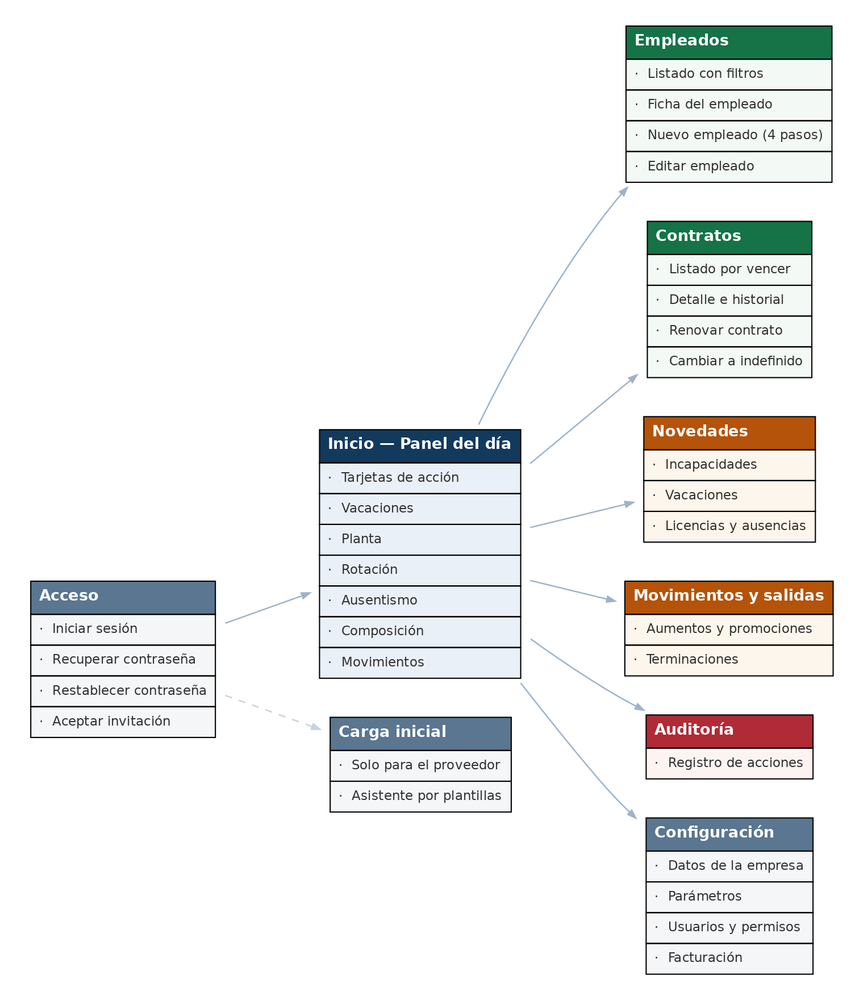

# Diseño de Producto e Interfaz — Sistema de Gestión de Talento Humano

> Documento de producto
> Documento de referencia del proyecto. Generado desde la fuente original; no editar a mano.

**DOCUMENTO DE PRODUCTO**
**Diseño de Producto e Interfaz**
**Sistema de Gestión de Talento Humano**
*Referentes, sistema de diseño y especificación de pantallas*
*Acompaña al prototipo navegable «Prototipo del sistema.html»*
Documento 4 · Versión 1.0

## Por qué existe este documento

En la cuarta sesión de trabajo quedó dicho que el éxito del producto dependerá de qué tan fácil sea de usar, y que teniendo la misma idea y los mismos módulos la ejecución puede ser muy buena o muy mala. Hasta ahora eso era una intención sin nada detrás: no había ni un boceto de pantalla.
Este documento convierte esa intención en decisiones concretas. Define cómo se ve el sistema, cómo se navega, qué componentes existen y cómo se comporta cada pantalla. El objetivo declarado del proyecto es que el producto no parezca hecho por una sola persona en sus ratos libres, y eso se consigue con consistencia, no con adornos.

> **Cómo se usa junto al prototipo**
>
> Este documento explica las decisiones. El archivo «Prototipo del sistema.html» las muestra: se abre con doble clic en cualquier navegador y permite recorrer las pantallas principales.
>
> Cuando haya una diferencia entre lo que dice el documento y lo que muestra el prototipo, manda el documento: el prototipo es una ilustración, no la fuente de verdad.

## Contenido

<!-- tabla de contenido generada por el editor -->

## 1. Qué hacen los demás

### 1.1 El panorama en Colombia y la región

El mercado de software de gestión humana en Colombia está ocupado, pero no en el segmento al que apunta este producto. Vale la pena entender dónde está cada quien para no competir donde no se puede ganar.

| Producto | A quién apunta | Qué hace |
|---|---|---|
| Buk | Empresas medianas y grandes. Es la referencia regional. | Suite completa de gestión de personas: nómina, evaluación de desempeño, capacitación, portal del empleado, remuneraciones. Implementación acompañada y de varios meses. |
| Aleluya | Pequeño y mediano empresario colombiano. | Nómina electrónica con foco en simplicidad y rapidez de puesta en marcha. Compite explícitamente contra los procesos de implementación largos. |
| Worky, Runa, Rankmi | Medianas y grandes en México y la región. | Suites de recursos humanos con módulos de nómina, asistencia y desempeño. |
| Softland, Siigo y similares | Empresas con necesidad contable primero. | Nómina como módulo de un ERP. La gestión humana es secundaria. |
| Zoho People, Factorial, Bizneo | PYMES, con enfoque internacional. | Buena relación precio-funcionalidad, pero no resuelven la normativa laboral colombiana con profundidad. |

### 1.2 Dónde está el espacio

**Todos los competidores relevantes tienen la nómina en el centro.** Este producto no calcula nómina, y eso, que parece una debilidad, define el espacio: no compite por ser la suite más completa sino por resolver bien tres cosas que las alternativas hacen mal para una empresa de veinte personas.
- Avisar a tiempo de los plazos legales colombianos, con las reglas de la reforma laboral de 2025 incorporadas.
- Calcular las vacaciones sin errores, con los tres tipos de conteo bien resueltos.
- Ser lo bastante simple para que una persona sin formación en recursos humanos lo use sin capacitación.

> **Lo que esto significa para el diseño**
>
> Un producto que compite por simplicidad no puede verse como una suite empresarial. La tentación de agregar pestañas, secciones y opciones para "verse completo" es exactamente lo que hay que resistir.
>
> La medida no es cuántas funciones tiene la pantalla, sino cuántos clics hay entre entrar al sistema y registrar una incapacidad.

### 1.3 Lo que la industria hace bien en 2026

De la revisión de prácticas actuales de diseño de producto B2B, cinco patrones aplican directamente aquí:

| Patrón | En qué consiste | Cómo se aplica aquí |
|---|---|---|
| Divulgación progresiva | Mostrar lo mínimo que el usuario necesita para su siguiente decisión y revelar el detalle solo cuando lo pide. | El registro de empleado en cuatro pasos en lugar de un formulario de veinticinco campos. Los filtros avanzados plegados por defecto. |
| Pantallas orientadas a la decisión | La pantalla de inicio se construye alrededor de las dos o tres decisiones que el usuario toma cada día, no alrededor de todos los datos disponibles. | El panel de inicio responde "¿qué tengo que hacer hoy?" antes de mostrar estadísticas. |
| Interfaz calmada | Menos color, menos movimiento, menos elementos compitiendo por atención. El color se reserva para significar algo. | Un solo color de acción. El rojo solo aparece cuando algo está mal de verdad. |
| Tablas densas pero legibles | Encabezado fijo al hacer scroll, columnas numéricas alineadas a la derecha, filtros aplicados de forma global. | Las seis pantallas de listado del sistema comparten el mismo comportamiento de tabla. |
| Los estados vacíos son momentos de incorporación | Una pantalla sin datos no dice "no hay datos": explica qué es esa sección y ofrece la primera acción. | Especialmente importante porque un cliente nuevo se encuentra con seis pantallas vacías el primer día. |

## 2. Principios de diseño

Cinco reglas para resolver las discusiones de diseño sin volver a discutirlas cada vez.

### 2.1 El usuario no es de recursos humanos

En una empresa de veinte personas, quien usa el sistema también lleva la caja menor, atiende el teléfono y organiza la logística. Entra unos minutos, hace una cosa concreta y se va. No va a leer un manual, no va a explorar, no va a recordar dónde estaba una opción que usó hace tres meses.
- Todo lo importante debe estar a un clic desde el inicio.
- Los nombres son los del oficio, no los del sistema: "Registrar una incapacidad", no "Crear nuevo registro de tipo incapacidad".
- Nada exige entrenamiento previo. Si una pantalla necesita explicación, la explicación va en la pantalla.

### 2.2 El sistema hace las cuentas, la persona toma las decisiones

Todo lo que el sistema puede calcular, lo calcula. Todo lo que puede deducir, no lo pregunta. Y cuando advierte algo, da el número exacto para que la persona decida.
- El saldo de vacaciones nunca se digita.
- Los días de una novedad se calculan al poner las fechas, y se ven antes de guardar.
- La advertencia de saldo insuficiente dice cuántos días faltan, no solo que faltan.

### 2.3 Consistencia por encima de creatividad

Seis módulos que se comportan igual se aprenden una sola vez. Un botón que cambia de lugar entre pantallas obliga a buscarlo cada vez.
- El botón de acción principal siempre arriba a la derecha.
- Las fechas siempre en el mismo formato y en el mismo tipo de control.
- Las acciones se llaman siempre igual: Nuevo, Editar, Eliminar, Exportar.
- Las seis tablas del sistema tienen la misma estructura, los mismos controles y el mismo comportamiento.

### 2.4 Nada se pierde en silencio

El sistema permite editar y eliminar todo, incluso registros de hace un año. La contrapartida es que ninguna acción destructiva ocurre sin que la persona sepa qué va a pasar.
- Antes de eliminar se explica la consecuencia concreta: "Se eliminarán 8 días de vacaciones y el saldo de Carlos Ramírez pasará de 4,25 a 12,25 días."
- Editar la fecha de ingreso advierte que el saldo se recalculará.
- Renovar y editar la fecha de finalización son botones distintos, con nombres distintos y consecuencias distintas explicadas.

### 2.5 Lo que delata a un producto improvisado

No es el diseño gráfico. Son los bordes:

| Detalle | Mal | Bien |
|---|---|---|
| Estado vacío | "No hay datos" | "Aún no has registrado incapacidades" con el botón para hacerlo y una línea explicando qué es esta sección. |
| Error de validación | "Error de validación" | "El documento 12345 no corresponde a ningún empleado activo." |
| Confirmación | "¿Está seguro?" | "Vas a eliminar la incapacidad del 14 al 16 de julio de Ana Torres. Esta acción queda registrada en la auditoría." |
| Espera | Pantalla congelada | Indicador de carga en cualquier acción que tarde más de un instante. |
| Guardado | Nada visible | Confirmación breve que desaparece sola, y la fila nueva resaltada un segundo en la tabla. |

## 3. Sistema de diseño

Las piezas con las que se construyen todas las pantallas. Definirlas una vez evita tomar cien decisiones pequeñas mientras se programa.

### 3.1 Color

Paleta corta y con significado. El color no decora: indica.

| Uso | Color | Dónde aparece |
|---|---|---|
| Marca / navegación | #123A5C | Barra lateral, encabezados de tabla, títulos. |
| Acción | #1B6EC2 | Botón primario, enlaces, elementos seleccionados. Es el único azul con el que se puede hacer clic. |
| Éxito | #157347 | Confirmaciones, estado activo, indicadores en verde. |
| Advertencia | #B45309 | Alertas que requieren atención pero no son errores: saldo insuficiente, contrato por vencer. |
| Error | #B02A37 | Validaciones fallidas, acciones destructivas, contratos vencidos. |
| Texto principal | #111827 | Todo el contenido. |
| Texto secundario | #4B5563 | Etiquetas, descripciones, texto de apoyo. |
| Bordes y separadores | #E5E7EB | Líneas de tabla, contornos de campos. |
| Fondo de la aplicación | #F7F8FA | Fondo general. Las tarjetas y tablas van en blanco encima. |

> **Dos reglas de color**
>
> El rojo solo aparece cuando algo está mal de verdad. Si todo se ve rojo, nada es urgente.
>
> Nada que no sea interactivo se pinta del azul de acción. Un texto azul que no se puede clicar es una promesa incumplida.

### 3.2 Tipografía

| Elemento | Tamaño | Peso |
|---|---|---|
| Título de pantalla | 24 px | Semibold |
| Título de sección o tarjeta | 18 px | Semibold |
| Texto general | 15 px | Regular |
| Texto de tabla | 14 px | Regular |
| Etiquetas de campo y texto de apoyo | 13 px | Medium |
| Cifra grande de indicador | 32 px | Semibold |

Una sola familia tipográfica, sin serifas, de las que están pensadas para pantalla e interfaz. Inter es la opción estándar y gratuita. Nada de mezclar familias.

### 3.3 Espaciado y forma

- Todas las medidas son múltiplos de 4. Los valores de uso frecuente son 8, 12, 16, 24 y 32.
- Esquinas redondeadas de 6 px en botones, campos y tarjetas. 8 px en modales.
- Sombras muy sutiles y solo en elementos que flotan: modales, menús desplegables, notificaciones.
- Ancho máximo del contenido de 1280 px. En pantallas más anchas, el contenido se centra en lugar de estirarse.

### 3.4 Componentes

| Componente | Especificación |
|---|---|
| Botón primario | Fondo azul de acción, texto blanco, altura 38 px. Uno solo por pantalla. |
| Botón secundario | Fondo blanco, borde gris, texto oscuro. Para acciones alternativas. |
| Botón de texto | Sin fondo ni borde. Para acciones de baja importancia como Cancelar. |
| Botón destructivo | Rojo, y solo dentro de una confirmación. Nunca suelto en una tabla. |
| Campo de texto | Altura 38 px, borde gris, etiqueta encima, texto de ayuda debajo cuando aporte. |
| Campo con error | Borde rojo y mensaje debajo explicando qué corregir. El mensaje reemplaza al texto de ayuda. |
| Lista desplegable | Con búsqueda cuando tenga más de diez opciones. Obligatorio en EPS, ciudades y bancos. |
| Selector de fecha | Calendario, con la posibilidad de escribir la fecha directamente. |
| Etiqueta de estado | Texto corto sobre fondo claro del color correspondiente: verde para activo, gris para inactivo, ámbar para por vencer, rojo para vencido. |
| Tabla | Encabezado fijo al hacer scroll, filas de 44 px, cifras alineadas a la derecha, la fila completa es clicable. |
| Modal | Ancho 560 px para formularios cortos y 800 px para el registro de novedades. Se cierra con Escape. |
| Notificación de confirmación | Aparece arriba a la derecha, desaparece a los cuatro segundos. |
| Tarjeta de indicador | Cifra grande, etiqueta debajo, variación frente al periodo anterior si aplica. |
| Estado vacío | Título, una línea de explicación y el botón de la acción principal. Centrado. |

### 3.5 Accesibilidad

- Contraste mínimo de 4,5 a 1 entre texto y fondo. La paleta definida lo cumple.
- El color nunca es el único portador de información: un estado siempre lleva texto además de color.
- Todo se puede recorrer con el teclado, con el foco visible.
- Los campos tienen etiqueta real, no solo texto de marca de agua dentro del campo.
- El sistema funciona con el navegador ampliado al 200% sin que se rompa el diseño.

## 4. Navegación

### 4.1 Estructura

Barra lateral fija a la izquierda con los módulos, y el contenido a la derecha. Es la estructura que cualquier persona reconoce sin explicación, y la que mejor soporta un sistema de seis o siete secciones.

*Mapa de navegación. Cada caja es una pantalla del sistema.*

### 4.2 El menú

| Sección | Contiene | Quién la ve |
|---|---|---|
| Inicio | Panel del día e indicadores. | Todos |
| Empleados | Listado, ficha y registro de personas. | Con permiso |
| Contratos | Contratos por vencer, detalle, renovaciones y cambio de modalidad. | Con permiso |
| Novedades | Tres subsecciones: Incapacidades, Vacaciones, Licencias y ausencias. | Con permiso |
| Movimientos | Aumentos salariales y promociones. | Con permiso |
| Terminaciones | Registro de salidas. | Con permiso |
| Auditoría | Registro de todas las acciones. | Con permiso |
| Configuración | Empresa, parámetros, usuarios y facturación. | Solo superadministrador |

**REGLA.** Un módulo al que el usuario no tiene acceso **no aparece en el menú** . Ocultarlo no es un control de seguridad —eso se verifica en el servidor— pero sí es una decisión de diseño: mostrar opciones que producen un mensaje de "no tienes permiso" es una forma de maltratar al usuario.

### 4.3 Encabezado

Una franja superior delgada con: el nombre de la empresa a la izquierda, para que nunca haya duda de dónde se está trabajando; y a la derecha el nombre del usuario con un menú de perfil y cierre de sesión.

## 5. Especificación de pantallas

Veintiuna pantallas cubren el MVP completo. Para cada una: qué muestra, qué se puede hacer y qué es lo importante.

### 5.1 Acceso

| Pantalla | Contenido y comportamiento |
|---|---|
| Iniciar sesión | Correo y contraseña, enlace de recuperación. Un solo campo de error general, sin decir si el correo existe. Tras tres intentos fallidos, espera creciente. |
| Recuperar contraseña | Campo de correo y mensaje neutro: "Si el correo está registrado, recibirás instrucciones". El enlace enviado expira en una hora. |
| Restablecer contraseña | Nueva contraseña con confirmación e indicador de fortaleza. Al guardar, entra directamente al sistema. |
| Aceptar invitación | Primer ingreso de un usuario creado por el superadministrador. Define su contraseña y ve un resumen de a qué módulos tiene acceso. |

### 5.2 Inicio

La pantalla más importante del sistema. Responde "¿qué tengo que hacer hoy?" antes de mostrar cualquier estadística.

##### Estructura, de arriba a abajo

1. Saludo breve y fecha.
2. Bloque de acción: tarjetas con las cosas que requieren atención. Contratos que vencen en 30, 60 y 90 días. Contratos vencidos sin gestionar. Periodos de prueba que terminan esta semana. Personas con vacaciones acumuladas en riesgo. Cada tarjeta es un enlace directo al listado filtrado.
3. Bloque de vacaciones: días acumulados por toda la planta, personas con acumulación excesiva, días disfrutados en el periodo.
4. Bloque de planta: empleados activos con su variación, distribución por tipo de contrato.
5. Bloque de rotación: índice del mes, voluntaria frente a involuntaria, rotación temprana, principales motivos de salida.
6. Bloque de ausentismo: índice por causa médica, días perdidos por origen, número de incapacidades, distribución por diagnóstico, días perdidos por ausencias no justificadas.
7. Bloque de composición: distribución por cargo, género, rango de edad y antigüedad.
8. Bloque de movimientos: aumentos y promociones del mes.

> **La diferencia entre las tarjetas de acción y los indicadores**
>
> Las tarjetas de acción son cosas que hay que hacer. Se ven distinto —con color de advertencia cuando corresponde— y llevan a una lista filtrada donde se puede actuar.
>
> Los indicadores son información. No llevan a ninguna parte y no gritan.
>
> Mezclarlos es el error más común en este tipo de paneles: se convierten en un tablero bonito que nadie usa para decidir nada.

### 5.3 Empleados

| Pantalla | Contenido y comportamiento |
|---|---|
| Listado | Tabla con documento, nombre, cargo, tipo de contrato, fecha de ingreso y estado. Filtros de estado, tipo de contrato, cargo, rango de fecha de ingreso y búsqueda por nombre o documento. Botones de Nuevo y Exportar. La fila completa lleva a la ficha. |
| Ficha del empleado | Encabezado con nombre, cargo, estado y saldo de vacaciones siempre visible. Debajo, pestañas: Datos personales · Contrato · Novedades · Movimientos. La pestaña de Novedades muestra las tres clases juntas en orden cronológico. |
| Nuevo empleado | Asistente de cuatro pasos con avance visible: 1) Identificación · 2) Residencia y seguridad social · 3) Información contractual · 4) Perfil sociodemográfico, solo si la empresa lo tiene habilitado. Se puede retroceder. Al terminar, resumen antes de guardar. |
| Editar empleado | El mismo formulario en una sola pantalla, sin pasos, porque quien edita ya sabe qué busca. La fecha de ingreso lleva una advertencia visible sobre el recálculo del saldo. |

> **La advertencia de reingreso**
>
> En el paso 1, cuando el documento digitado ya tuvo una vinculación anterior en esa empresa, aparece un aviso ámbar debajo del campo, antes de continuar:
>
> "Esta persona ya tuvo una vinculación anterior con la empresa. Verifique si es válido pactar periodo de prueba en este contrato."
>
> Y en el paso 3, junto al tipo de contrato: "Por configuración del sistema recibirás las alertas de periodo de prueba. Sin embargo, te corresponde verificar si ese periodo de prueba es válido, considerando que la persona ya tuvo una vinculación previa."
>
> Si el reingreso ocurrió dentro de los 30 días siguientes a la salida anterior, el aviso se muestra con más énfasis e indica la fecha de la salida.

### 5.4 Contratos

| Pantalla | Contenido y comportamiento |
|---|---|
| Listado de contratos | Tabla con empleado, tipo de contrato, fecha de inicio, fecha de vencimiento, prórrogas acumuladas, fecha límite de preaviso y estado. Vista por defecto: los que vencen en los próximos 90 días, ordenados por fecha. Filtros de rango de vencimiento, tipo de contrato y número de prórrogas. |
| Detalle del contrato | Datos del contrato vigente, la fecha límite de preaviso destacada, y debajo el historial completo de periodos empezando por el inicial. Dos botones: Renovar contrato y Cambiar a término indefinido, ambos solo en contratos a término fijo. |
| Renovar contrato | Modal. Muestra el periodo vigente y pide la nueva fecha de finalización y el tipo de prórroga. Al escribir la fecha, calcula y muestra la duración de la prórroga, el total acumulado del vínculo y las prórrogas que quedarán. Si la nueva fecha supera el tope legal o incumple la regla de prórroga mínima, muestra el error y no deja guardar. |
| Cambiar a indefinido | Modal de confirmación que explica qué implica: el vínculo continúa, la fecha de ingreso no cambia, y las alertas de vencimiento dejan de generarse. |

### 5.5 Novedades

Las tres subsecciones comparten exactamente la misma estructura. Aprender una es aprender las tres.

##### Flujo de registro, idéntico en las tres

1. En la tabla del módulo, el usuario pulsa Nuevo.
2. Se abre un modal pequeño que pide solo el número de documento.
3. Al salir del campo, el sistema valida. Si no existe o no está activo, muestra el mensaje debajo del campo y no deja continuar.
4. Si existe, el modal pequeño se reemplaza por uno grande. Arriba, una ficha del empleado con nombre, cargo, fecha de ingreso y saldo de vacaciones. Debajo, el formulario de la novedad.
5. Al completar las fechas, el sistema calcula y muestra los días antes de guardar.

| Módulo | Particularidades |
|---|---|
| Incapacidades | Campos de fechas, código de diagnóstico, prórroga, EPS y origen. Los días se cuentan corridos y se muestran al completar las fechas. El campo de diagnóstico solo aparece para usuarios con permiso. |
| Vacaciones | Fechas y días hábiles calculados. Debajo, una franja permanente con el saldo actual del empleado y el saldo proyectado a la fecha de disfrute. Si los días solicitados superan el saldo proyectado, aparece una advertencia ámbar con el número exacto: "Al 28 de agosto tendrá 12,75 días disponibles. Estás registrando 14 días: faltan 1,25 días." La advertencia no bloquea. |
| Licencias y ausencias | Un selector de tipo con tres opciones —licencia no remunerada, ausencia, suspensión— y las fechas. Los días se cuentan corridos, incluidos domingos y festivos, y así se explica en el texto de ayuda debajo del cálculo. |

### 5.6 Movimientos, terminaciones y auditoría

| Pantalla | Contenido y comportamiento |
|---|---|
| Movimientos salariales | Mismo flujo de registro. El formulario muestra el salario y el cargo actuales como texto fijo, y pide los nuevos. Si el movimiento es un aumento, el cargo nuevo se rellena solo con el actual. |
| Terminaciones | Mismo flujo. Al elegir el tipo de salida, la lista de motivos se recarga con las opciones de ese tipo. En expiración del plazo y terminación de obra, el motivo se autocompleta y el campo queda deshabilitado. Antes de guardar, confirmación explicando que el empleado pasará a inactivo y dejarán de generarse alertas. |
| Auditoría | Tabla de solo lectura con fecha y hora, usuario, módulo, acción, registro afectado y detalle del cambio. Filtros de rango de fechas, usuario, módulo y tipo de acción. Al abrir una fila, un panel lateral muestra los valores anteriores y nuevos lado a lado. |

### 5.7 Configuración

| Pantalla | Contenido y comportamiento |
|---|---|
| Datos de la empresa | Solo lectura para el cliente, con una nota de que los cambios se solicitan al proveedor. |
| Parámetros | Los cuatro parámetros: sábado laboral, efecto de las suspensiones sobre vacaciones, perfil sociodemográfico y correos que reciben las alertas. Cada uno con una explicación en lenguaje claro de qué cambia al activarlo. Al activar el perfil sociodemográfico, se advierte que los empleados ya registrados quedarán con esos campos vacíos. |
| Usuarios y permisos | Listado de usuarios con su rol y módulos. Al crear uno, se pide nombre y correo, se marcan los módulos y se envía la invitación. Un usuario se desactiva, no se borra. |
| Facturación | Plan contratado, número de empleados y usuarios incluidos, historial de pagos y medio de pago. Solo el superadministrador. |

### 5.8 Carga inicial

Pantalla del proveedor, no del cliente. Es un asistente por pasos:
1. Elegir la empresa y descargar las plantillas.
2. Subir la plantilla de empleados. El sistema valida sin escribir nada y muestra el resultado: filas correctas, filas con error, y para cada error el número de fila y el motivo.
3. Corregir y repetir hasta que no haya errores, y confirmar la carga.
4. Subir opcionalmente las plantillas de histórico, una por una, con el mismo ciclo.
5. Resumen final: qué se cargó, cuántos registros y quién lo hizo.

## 6. Patrones y textos

### 6.1 Comportamiento estándar de las tablas

- Encabezado fijo al desplazarse.
- Ordenamiento al pulsar el encabezado de columna.
- Paginación de 25 filas, con opción de 50 y 100.
- Los filtros aplicados quedan visibles como etiquetas removibles encima de la tabla.
- El botón de Exportar respeta los filtros activos y lo dice: "Exportar 43 registros filtrados".
- **Toda exportación incluye documento, nombre completo y cargo** , además de los campos propios del módulo.
- Al volver a una tabla desde una ficha, los filtros y la página siguen donde estaban.

### 6.2 Formularios

- Validación al salir de cada campo, no al guardar. El caso del documento inexistente es el ejemplo, pero la regla aplica a todo.
- Los campos obligatorios no se marcan con asterisco: se marcan los opcionales con la palabra "opcional", porque en este sistema casi todo es obligatorio.
- Los valores que el sistema puede deducir vienen precargados: país Colombia, fecha de ingreso hoy, cargo nuevo igual al actual en un aumento.
- Si el usuario intenta salir con cambios sin guardar, se le avisa.
- El botón de guardar se deshabilita mientras se envía, para evitar el doble registro.

### 6.3 Textos del sistema

| Situación | Texto |
|---|---|
| Empleados sin registros | Aún no hay empleados registrados. Aquí verás a todo tu personal y desde aquí podrás registrar contrataciones. — Botón: Registrar empleado |
| Incapacidades sin registros | Aún no has registrado incapacidades. Cuando registres una, aquí verás el detalle y podrás exportarlo. — Botón: Registrar incapacidad |
| Búsqueda sin resultados | No encontramos resultados con estos filtros. — Botón: Quitar filtros |
| Documento inexistente | El documento {número} no corresponde a ningún empleado activo. Verifica el número o registra primero al empleado. |
| Guardado correcto | Incapacidad registrada. |
| Confirmación de borrado | Vas a eliminar {descripción del registro}. {Consecuencia concreta}. Esta acción queda registrada en la auditoría. |
| Sin permiso | No tienes acceso a esta sección. Si crees que deberías tenerlo, habla con el administrador de tu empresa. |
| Sesión expirada | Tu sesión terminó por inactividad. Vuelve a entrar para continuar. |
| Error inesperado | Algo salió mal de nuestro lado. Ya nos enteramos y lo estamos revisando. Intenta de nuevo en unos minutos. |

### 6.4 Comportamiento en pantallas pequeñas

El uso principal es de escritorio, pero alguien va a abrirlo desde el celular y esa primera impresión cuenta.
- Hasta 1024 px, la barra lateral se colapsa en un menú desplegable.
- Las tablas pasan a formato de tarjeta: una tarjeta por registro, con los tres campos más importantes.
- Los modales ocupan la pantalla completa.
- El panel de inicio apila los bloques en una sola columna, respetando el orden de prioridad.

## 7. El prototipo

El archivo «Prototipo del sistema.html» está en esta misma carpeta. Se abre con doble clic en cualquier navegador, no requiere internet ni instalación, y no envía información a ninguna parte.

### 7.1 Qué contiene

- Las pantallas principales del sistema con datos de ejemplo.
- Navegación real entre secciones.
- El sistema de diseño aplicado: colores, tipografía, componentes y estados.
- Los flujos que más se discutieron: el registro de una novedad con la validación del documento, la advertencia de saldo insuficiente y la renovación de contrato con sus validaciones.

### 7.2 Para qué sirve

- Para que Angela vea el sistema antes de que exista y opine sobre algo concreto en lugar de sobre una descripción.
- Para que David tenga una referencia visual mientras programa, en lugar de decidir el diseño mientras escribe la lógica.
- Para la conversación comercial: mostrar pantallas es infinitamente más efectivo que explicar módulos.

### 7.3 Qué no es

No es el sistema. No guarda nada, no calcula de verdad y los datos son inventados. Es un dibujo interactivo cuyo propósito es alinear el criterio antes de escribir código, que es cuando cambiar de opinión todavía es barato.

*Fin del documento de Diseño — Versión 1.0*
